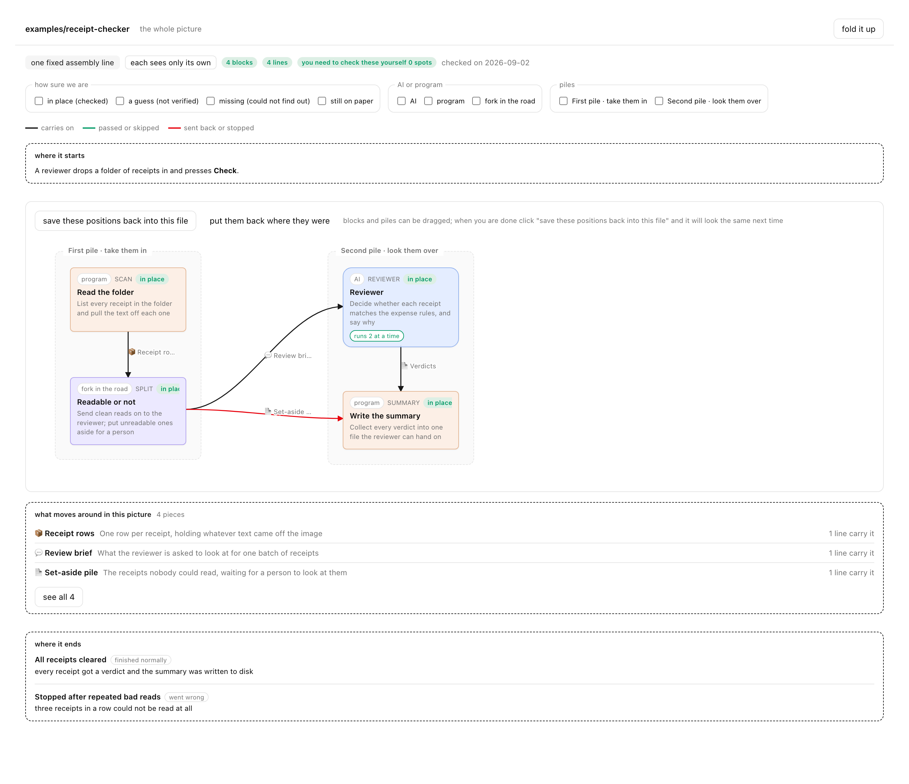
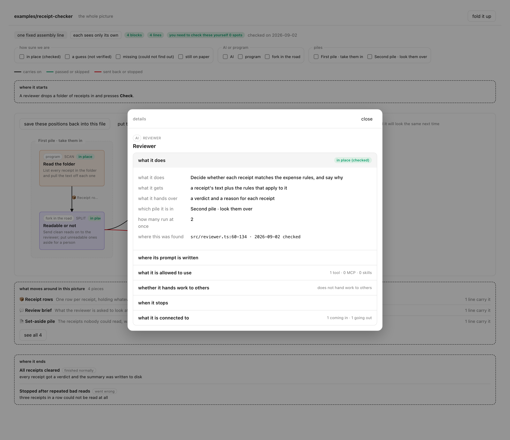
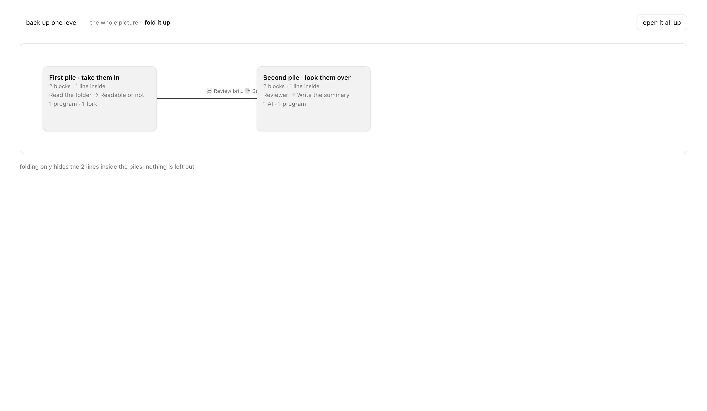

# agentic-topology

**English** · [中文](./README.zh-CN.md)

Draw the orchestration of an agentic app as a diagram you can click into.

Point it at a repo and say "draw this project's orchestration." It reads the source and pulls out
**which AIs exist, what tools each one has, what the deterministic code between them does, who calls
whom, and what gets handed over** — then renders **a single HTML file that opens offline**.



That is the bundled sample rendered with `--lang en`. Fill color says only who is doing the work:
blue for AI, orange for program, purple for branch point. Every line says **which pieces of
information it carries** — the icon is how each one is handed over, and clicking a name lights up
every line carrying that same piece. Under the canvas, *what moves around in this picture* lists
them all. **It tells you what it found, not what it thinks of it.**

> The prose on the diagram — box names, what each one does, what each piece of information is —
> is the analysed project's own words, and `--lang en` never translates it. So these screenshots
> come from an English sample. For a diagram read from a **real** 1,500-line internal-audit module
> (10 boxes, 14 connections, 4 things flagged to verify), see the
> [Chinese README](./README.zh-CN.md).

Click any box and its full detail opens in a panel — **every box and every connection carries a
`file:line` citation**:



Too many boxes? Collapse them by group. Nothing is dropped when you do:



---

## 30 seconds

```bash
npx agentic-topology install
```

Then **say one sentence to your coding agent**:

> draw this project's orchestration

That's it. The diagram lands in your working directory; double-click to open.

**You never write a description file and never run another command.** The next section explains why.

---

## What is `<description-file>`? Do I have to write it?

**No. Not a single character.**

There's an intermediate artifact here called an **orchestration description**
(`<topic>.topology.yaml`). Seeing `<description-file>` in the CLI usage, people often assume it's a
form they have to fill in. It isn't. Here's where it comes from:

```
   you say "draw this project's orchestration"
              ↓
   the agent reads the source and writes <topic>.topology.yaml itself   ← created here
              ↓
   a validator checks it line by line (fails → no diagram, and it names what's missing)
              ↓
   rendered to <topic>.topology.html                                    ← what you open
```

**The description is written by the agent for the validator — not by you.** It exists for exactly
one reason:

> Let the **model do the reading**, and let a **deterministic program decide whether what it read
> is allowed to become a diagram**.
>
> The model may misread or read partially. What it *cannot* do is bypass the check — omit a required
> field, invent a node ID that doesn't exist, or label a guess as verified. The validator refuses to
> render and points at the exact spot. That boundary is why this diagram is worth trusting.

Keeping it on disk buys two more things: **you can edit it directly** (then re-render), and
**a later run can resume** — a description with `analysis_complete: false` keeps the boxes and
connections already found.

### When you actually type a command

Only two cases:

| Case | Command |
|---|---|
| You already have a description and just want the diagram | `npx agentic-topology render <description-file>` |
| You edited a description and want to check it | `npx agentic-topology validate <description-file>` |

On the normal path you need neither.

---

## What ends up on the diagram

| On the diagram | What it means |
|---|---|
| **AI / program / branch point** | Three box types split by fill color — AI blue, program orange, branch point purple — so it's obvious what a model does vs. what deterministic code does |
| **Each AI's system prompt** | Which file, which lines — click to expand that exact range |
| **Tools / MCP / Skills** | What each AI has. "None" is written as `[]`; "couldn't determine" gets a ⚠ badge instead, so the two never blur together |
| **When it stops** | Steps, time, cost, consecutive failures — all four, and "not set" is stated explicitly |
| **Who calls whom, carrying what** | Every connection carries its trigger, concurrency control, and the pieces of information it hands over — each reference saying *how* it is handed over and *when* |
| **What moves around, as a thing in its own right** | Each piece of information is written **once** and referenced by every line that carries it, so "these three lines all carry the same thing" is visible instead of guessed. The line shows its name plus a one-character icon for how it's handed over (at most three, then *+N total*); click a name and every line carrying it lights up while the rest fade. A list under the canvas — and a full seven-column view — gives what it is, roughly what's inside, what form it takes, where it comes from and ends up, and where that was found |
| **"These two might be the same thing"** | When the reading can't establish that two pieces are the same, they stay **separate**, both marked *a guess*, with one pointing at the other — and that pair lands in the verify-this list by name. It never quietly merges them to make the chain look tidy |
| **Where it starts and where it ends** | Bracketing the canvas: the entry path sits above the diagram, and the normal, abnormal, and cancelled exits below it |
| **How sure it is** | Four levels: landed (verified) / inferred (a guess) / missing (couldn't determine) / by design. All four carry a badge; the last three also get a dashed border. You can filter on it |
| **Verify-this list** | A ⚠ badge in the corner of the box it belongs to, a tooltip on the connection, or a badge next to the piece of information in the list; the top bar carries only the total — click the thing you want to check, no separate table to hunt through |
| **Chinese or English** | `--lang zh` (the default) or `--lang en` switches the page's own wording. The description's prose is never translated |
| **Laid out the way you want** | Boxes and groups drag, connections re-route live; "save the positions into this file" writes them back into the same HTML so it opens that way next time (browsers without the File System Access API download a new copy for you to overwrite instead), and one click restores the automatic layout |

Every prose field (boxes, detail, entry, exits, stop conditions, payloads) goes through Markdown, so
long sentences aren't broken up by whatever hand-wrapping the YAML happened to have.

**It does not judge your architecture or suggest improvements.** The point is to let you see clearly
enough to judge for yourself.

---

## Install

```bash
# Claude Code (default)
npx agentic-topology install

# Codex
npx agentic-topology install --agent codex

# A directory you pick
npx agentic-topology install --dir path/to/skills/agentic-topology
```

Only the deliverables are copied (`SKILL.md` + `references/` + `assets/` + `scripts/`) — no tests, no
development docs.

Reinstalling **wipes the target directory first** (leftover files from an older version would leave
the agent reading two contradictory rulebooks at once). Because it wipes, four guards run before
anything is deleted: the target is the skill's own source directory → refused; it is the current
directory or an ancestor of it → refused; it is an ancestor of the skill's own source → refused;
it already exists, is non-empty, and holds no `SKILL.md` of this skill → refused **without deleting
anything**, so you can confirm yourself. A slip like `--dir .` cannot wipe your working directory.

**Requires** Node ≥ 18. **Zero npm dependencies.** No network access, and your code is never uploaded.

---

## CLI

```bash
npx agentic-topology install  [--agent claude|codex] [--dir <dir>]
npx agentic-topology render   <description-file> [-o <output.html>] [--force] [--lang zh|en]
npx agentic-topology validate <description-file> [--format json]
```

`--lang` defaults to `zh`. An unknown value is an error listing what is accepted — it never
quietly falls back, which would hand you a Chinese page while you believed `--lang en` had worked.

Exit codes: `0` ok · `2` validation failed · `3` syntax error or file unreadable · `1` internal error

When validation fails **no HTML is produced at all** — instead it prints which box, which line, and
which field is missing.

---

## Boundaries it holds

These aren't design aspirations. They're constraints with tests behind them:

| Constraint | How it's enforced |
|---|---|
| **Your project is only ever read** | The renderer **refuses** to write the diagram inside the analyzed project, and a test holds that. The analysis side is held by the extraction discipline rather than by a test — check it yourself with `git status` before and after |
| **Exactly one place writes files** | Only `scripts/lib/write-output.mjs` touches filesystem writes; asserted on both call shape and `node:fs` named imports |
| **Same description, same diagram** | Byte-identical when neither the description nor the analyzed project has changed. No timestamps, no randomness, nothing depending on iteration order. The one thing that does track outside change is the "this diagram may be stale" notice — it reads source-file mtimes, which is exactly what it's for. (Positions you drag live in that HTML file itself; re-rendering returns to the computed layout) |
| **Guesses are never shown as facts** | The validator rejects "documentation-only source but marked verified"; fill color carries type only, while confidence gets its own channel — a dashed border plus a badge |
| **Nothing is silently dropped** | Crowding is handled by folding and filtering; unfold restores every ID |
| **No network** | Zero dependencies; the output is one HTML file that works offline. Even the Markdown in the page goes through a tiny renderer that ships with it — no CDN, no external assets |
| **The skill is self-contained** | It references and depends on no other skill, with a test scanning every deliverable |

---

## Repository layout

```
agentic-topology/        the skill and CLI — this directory is what the npm package ships
  SKILL.md                 the agent's entry point: four-step flow and when to load what
  references/              four contracts: description format / node granularity / extraction discipline / UI wording
  scripts/                 validator, layout, renderer
  assets/                  page shell and a minimal example you can edit directly
  bin/                     npx entry point and installer
  tests/                   test suite, node:test, zero dependencies (`npm test`)

assets/images/           screenshots for the Chinese README (Chinese UI)
assets/images/en/        screenshots for this README (English UI)
                         both serve the READMEs only and are not installed
tools/shoot.mjs          re-shoots all six, both languages, in one run
```

---

## What works today, and what doesn't

**Works**: rendering from a filled-in description, validation with per-field errors, group folding,
filtering by confidence and type, box and connection drill-down in a panel, prompt ranges expanded inline,
verify badges, drag-to-arrange with positions saved back into the file, non-clobbering regeneration,
staleness notices, information as a first-class thing with click-to-highlight, Chinese and English UI.

**Missing**: the ship line requires **zero missed agent nodes and zero missed call edges across 3
real projects**. It is **not met**. Three things are outstanding:

1. **A third benchmark project.** The one we ran excluded the very package that assembles the system
   prompt — while "which system prompt is assembled" is exactly the criterion for what counts as an
   Agent. On top of that, one of this skill's own mandatory-load references uses that project as a
   worked example and states the answer, so the blind test could not be blind. That round is void.
2. **A granularity ledger for the first two projects.** The "zero missed edges" metric leans on
   "a merge into a node MUST be recorded" — that record is its only anti-gaming check. Without it,
   coarsening the cut until transfers sink inside nodes scores a zero while information is genuinely
   lost. So those two zeros are "measured as zero," not "established as zero."
3. No single round has yet satisfied all three at once: correct scope, complete ledger, no leak.

**Known gaps**: runtime tracing (it reads static source, so branches decided at runtime are
invisible), prompt redaction on export, and no way to express "a phase inside a single session."

---

## License

MIT
