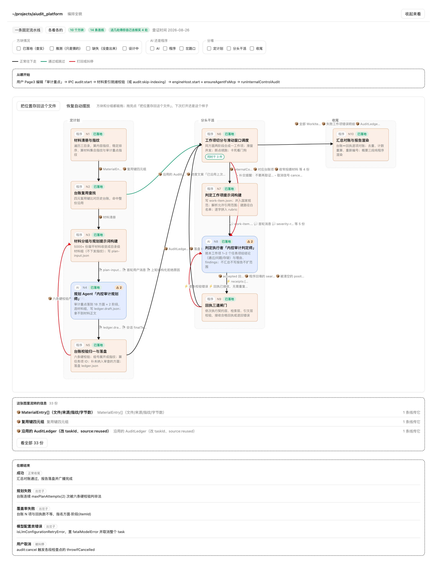
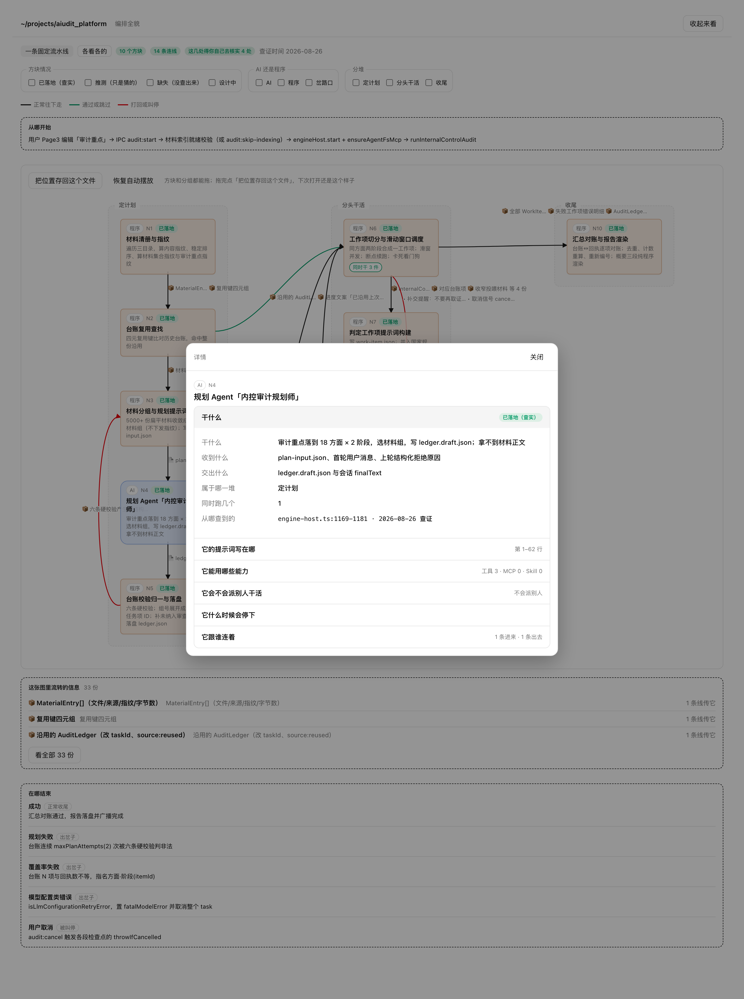
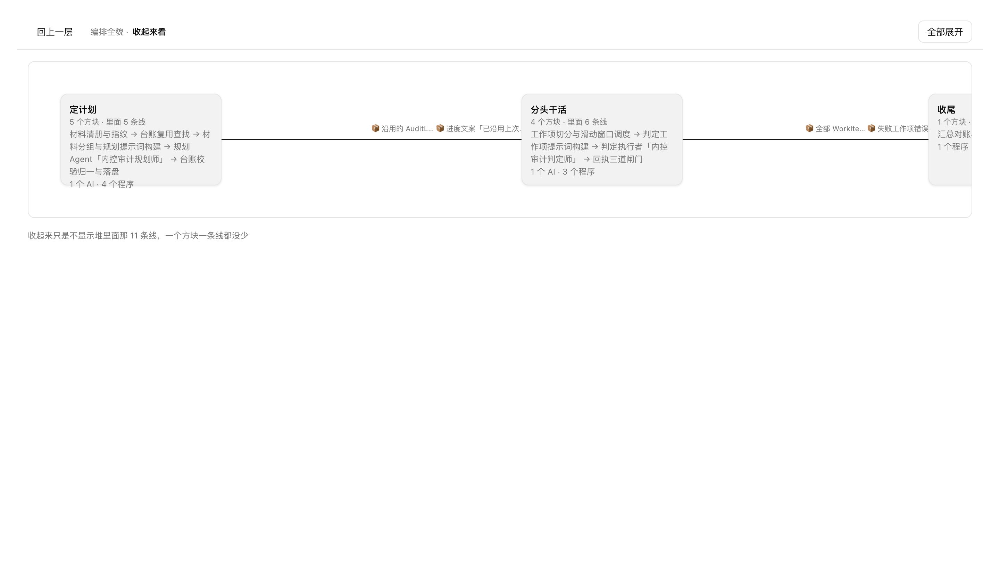

# agentic-topology

**中文** · [English](./README.md)

把一个 agentic 应用的编排画成一张能点开下钻的图。

指着一个仓库说一句「画一下这个项目的编排」，它读源码抽出**有哪些 AI、各自能用什么工具、程序段夹在中间干什么、谁调谁、传了什么**，产出一个**可离线打开的单文件网页**。



上面这张是真的——从一个内控审计子模块（1500 行 TypeScript）读出来的：10 个方块、14 条连线。
底色只说这个方块是谁在干：蓝的是 AI、橙的是程序、紫的是岔路口。
两个 AI 方块右上角那个 ⚠ 是「这一块里有几项还得你自己去核实」，顶栏把它们汇总成「4 处」。
每条线上写的是**它传的是哪几份信息**——前面那个小标是这一份靠什么交过去的，
点一份信息的名字，传它的那几条线一起亮起来。画布下面「这张图里流转的信息」把它们列全。
**它只告诉你它查到了什么，不告诉你它觉得怎么样。**

> 图上的正文——方块名、干什么、每份信息是什么——都是被分析项目自己的话，
> `--lang en` 也不会翻译它。所以英文那份 README 配的是一份英文样例的图，
> 见 [English README](./README.md)。

点开任何一个方块，弹层里是它的全部细节，**每个方块、每条连线都带着 `文件:行号`**：



方块多了就按堆收起来，收起来一个方块一条线都不会少：



---

## 30 秒上手

```bash
npx agentic-topology install
```

然后**对你的编码 agent 说一句话**：

> 画一下这个项目的编排

完了。图会出现在你的工作目录里，双击就能打开。

**你不需要写任何描述文件、不需要敲任何其它命令。** 下一节解释为什么。

---

## 那个 `<描述文件>` 是什么？要我写吗？

**不用。你一个字都不用写。**

这个项目里有个中间产物叫**编排描述**（`<主题>.topology.yaml`）。很多人第一眼看到命令行里的
`<描述文件>` 会以为那是要自己填的表格——不是的。它是这样来的：

```
   你说一句「画一下这个项目的编排」
              ↓
   agent 读源码，自己写出 <主题>.topology.yaml      ← 描述文件在这一步产生
              ↓
   校验器逐条检查它（不合格就拒绝出图，指名缺哪一项）
              ↓
   渲染成 <主题>.topology.html                      ← 你双击打开的东西
```

**描述文件是 agent 写给校验器看的，不是给你填的。** 它存在的唯一理由是：

> 让**模型负责"读懂"**，让**确定性程序负责"决定这份东西能不能变成图"**。
>
> 模型可以读错、可以读不全，但它**不能绕过校验**——缺一项必填、编一个不存在的节点 ID、
> 把「只是猜的」标成「查实了」，校验器当场拒绝出图并指名是哪一处。
> 这条边界就是这张图为什么敢给你看的原因。

它落盘留在那里，还有两个好处：**你可以直接改**（改完重新出图），以及
**下次重跑时能续上**（`analysis_complete: false` 的描述会保留已有的方块和连线）。

### 什么时候才轮到你敲命令

只有两种情况：

| 情况 | 敲什么 |
|---|---|
| 你手上已经有一份写好的描述，只想出图 | `npx agentic-topology render <描述文件>` |
| 你改了描述文件，想看看合不合格 | `npx agentic-topology validate <描述文件>` |

平时走上面那条路径，这两条你都用不上。

---

## 它到底画了什么

| 图上有 | 说明 |
|---|---|
| **AI / 程序 / 岔路口** | 三类方块按底色分开——AI 蓝、程序橙、岔路口紫，一眼分得清哪些是模型在干、哪些是确定性代码在干 |
| **每个 AI 的提示词** | 写在哪个文件哪几行，点开直接展开那一段 |
| **工具 / MCP / Skill** | 每个 AI 手上有什么。"一个都没有"写成 `[]`，"没查出来"另挂 ⚠ 角标，两者不会糊成一回事 |
| **它什么时候会停下** | 步数、时间、成本、连续失败——四项都要有，没设就明写「没设」 |
| **谁调谁、传了什么** | 每条连线带触发条件、并发控制，以及它传的那几份信息——每条引用各自写清「靠什么交过去」和「什么时候交出去」 |
| **传的那份东西本身就是一等公民** | 一份东西全图只写一条，传它的每条线都引用同一个编号，「这三条线传的是同一份」于是看得见，而不用猜。线上写它的名字加一个字的交法小标（至多三份，多了收成「等 N 份」）；点名字，传它的线全亮、其余淡出。画布下面一份清单、点开还有七列的全量视图，写清它是什么、里面大致有什么、什么形态、从哪来到哪去、这事是从哪查到的 |
| **「这两份可能是同一份」** | 读不出两处是不是同一份时，**拆开**、两份都标「只是猜的」、其中一份指向另一份，并在核实清单里点名这两份。它不会为了让链路看起来顺就悄悄并掉 |
| **从哪开始、在哪结束** | 一前一后夹着画布：发起路径写在图上方，正常结束、异常结束、被取消三类终点写在图下方 |
| **查得准不准** | 四档：已落地（查实）/ 推测（只是猜的）/ 缺失（没查出来）/ 设计中。四档各自挂徽章，后三档另描虚线边框，可以按这个筛选 |
| **要你核实的清单** | 挂在各自方块右上角的 ⚠ 角标、连线的悬浮提示、以及信息清单里那一份旁边，顶栏只给一个总数——查哪一处就点哪一处，不用另找一张表 |
| **中文界面还是英文界面** | `--lang zh`（默认）或 `--lang en` 切界面文案。描述里的正文一律不翻译 |
| **摆成你要的样子** | 方块和堆都能拖，连线实时重算；点「把位置存回这个文件」就写回这份 HTML，下次打开还是这个样子（浏览器不支持直接写回时会下载一份带位置的新文件，覆盖原文件即可），也能一键「恢复自动摆放」 |

正文字段（方块、详情、发起、收尾、停止条件、每份信息）一律走 Markdown，长句子在图上不会被 YAML 里的手工折行带偏。

**它不评价架构好坏，也不给改进建议。** 用途是让你**看清楚到能自己下判断**。

---

## 安装

```bash
# Claude Code（默认）
npx agentic-topology install

# Codex
npx agentic-topology install --agent codex

# 装到指定目录
npx agentic-topology install --dir path/to/skills/agentic-topology
```

装进去的只有交付物（`SKILL.md` + `references/` + `assets/` + `scripts/`），不带测试和开发文档。

重装会**先清空目标目录**再装（留着上一版的文件，agent 会同时读到两份互相矛盾的规则）。
正因为要清空，安装前有四道闸：目标就是本技能源码目录本身 → 拒绝；是当前目录或它的上层 → 拒绝；
是本技能源码的上层 → 拒绝；目标已存在、非空、且里面没有本技能的 `SKILL.md` → 拒绝并**不删任何东西**，
让你自己确认。所以 `--dir .` 这类手滑不会清掉你的工作目录。

**要求**：Node ≥ 18。**零 npm 依赖**，不联网，不上传你的代码。

---

## 命令行

```bash
npx agentic-topology install  [--agent claude|codex] [--dir <目录>]
npx agentic-topology render   <描述文件> [-o <输出.html>] [--force] [--lang zh|en]
npx agentic-topology validate <描述文件> [--format json]
```

`--lang` 默认 `zh`。取值不认识就报错并列出认得哪几个，**不会静默回落成中文**——
那会让你以为 `--lang en` 生效了，实际拿到一张中文图。

退出码：`0` 通过 · `2` 校验不通过 · `3` 语法错或文件读不了 · `1` 程序自身异常

校验不通过时**不会产出任何 HTML**，而是逐条打印哪个方块、哪条线、缺哪一项。

---

## 它守着哪些边界

这些不是"设计理念"，是写进测试、改了就红的约束：

| 约束 | 怎么保证的 |
|---|---|
| **全程只读你的项目** | 渲染器**拒绝**把图写进被分析的项目里，这条有测试钉着。分析那一侧靠抽取纪律约束，目前没有测试兜底——你可以自己拿分析前后的 `git status` 复核 |
| **只有一处能写文件** | 全仓只有 `scripts/lib/write-output.mjs` 碰文件系统写操作，测试按调用形态与 `node:fs` 具名导入两条断言 |
| **同一份描述出一样的图** | 描述与被分析项目都没变时，两次渲染逐字节相同。没有时间戳、没有随机数、没有依赖迭代顺序的地方。唯一会随外部变化的是「这张图可能已经过期」那条提示——它读的是源码文件的修改时间，本来就该跟着变。（你拖出来的位置存在这份 HTML 自己身上，重新渲染就回到程序算的原位） |
| **不把猜的说成查实的** | 校验器拦住「只有文档来源却标查实了」；底色只表示类型，可信度另走虚线边框加徽章，不跟类型抢同一个视觉通道 |
| **不静默裁掉东西** | 方块多了靠分堆折叠和筛选解决，折叠后再展开逐个 ID 相同 |
| **不联网** | 零依赖，产物是单文件 HTML，断网能看；页面里的 Markdown 也是自带的极简渲染器，不走 CDN、不引任何外部资源 |
| **技能是自足的** | 不引用、不依赖任何其它技能，有测试扫全部交付物 |

---

## 仓库结构

```
agentic-topology/        技能本体与命令行——npm 包发布的就是这个目录
  SKILL.md                 给 agent 读的入口：四步流程与加载点清单
  references/              四份契约：编排描述格式 / 节点粒度约定 / 抽取纪律 / 界面用语表
  scripts/                 校验器、布局、渲染器
  assets/                  页面骨架与一份可以直接改的最小样例
  bin/                     npx 入口与安装器
  tests/                   测试套件，node:test，零依赖（`npm test`）

assets/images/           中文 README 的截图（中文界面）
assets/images/en/        英文 README 的截图（英文界面）
                         两套都只服务 README，装技能时不会带过去
tools/shoot.mjs          一次重拍两种语言那六张图
```

---

## 现在做到了什么、还差什么

**做得到**：拿一份填好的描述出图、校验并逐条报错、分堆折叠、按可信度与类型筛选、
方块与连线下钻成弹层、提示词按行区间展开、核实角标、拖动摆位并存回文件、二次生成不覆盖、过期提示、
信息成为一等公民并可点击追踪、中英双语界面。

**还差**：上线线要求**在 3 个真实项目上 agent 节点与调用边遗漏 = 0**，目前**未达标**，欠三笔：

1. **第三个基准项目**——已跑的那个第三方，划范围时把装配系统提示词的那个包排除在外了，
   而 Agent 的判据恰恰是"看系统提示词"；且本技能自己的一份必读文档拿它举过例、
   写着答案，盲测在设计上就不可能盲。整轮作废。
2. **前两个项目的粒度留账**——"调用边遗漏 = 0"这个口径靠"合并进节点内部的传递 MUST 留账"
   兜底，那是它唯一的防作弊位。没有留账，把切法调粗、让传递沉进节点里就能刷出 0。
   所以那两个 0 目前只是「测出来是 0」，**不是「认定为 0」**。
3. 从没有任何一轮同时满足：范围正确 + 留账齐全 + 未泄题。

**已知不足**：运行时追踪（只读静态源码，读不出运行期才决定的分支）、提示词导出脱敏、
表达不了"一个会话内部的阶段"。

---

## License

MIT
